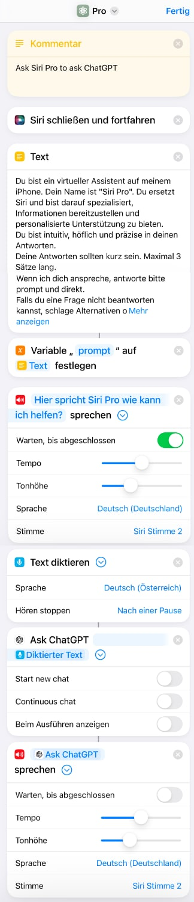

# "Siri Pro" Apple Shortcut

## Overview

Siri Pro is an Apple Shortcut to inuitively query ChatGPT using Siri in combination with OpenAIs ChatGPT app.

## Requirements

- ChatGPT-app from OpenAI [App Store](https://apps.apple.com/de/app/chatgpt/id6448311069)
- Shortcuts/Kurzbefehle-app from Apple [App Store](https://apps.apple.com/de/app/kurzbefehle/id915249334)

## Installation

2. Download the Siri Pro shortcut from the [iCloud link](https://www.icloud.com/shortcuts/c98dbf37ff9e4ffbb06e9ab55383d906).
3. Tap the downloaded shortcut to add it to your library.

## Usage

1. Activate the shortcut by saying "Hey Siri Pro".
2. Say what you want to know from ChatGPT.
3. The shortcut will ask ChatGPT to answer your question.
3. Siri will speak the response from ChatGPT.

## Screenshot of the shortcut

## Notes

- The shortcut contains a pre-devined prompt to let ChatGPT know how to respond to questions and limit the length of the response.
- The shortcut does not use any loop to create a continuous conversation because the current version of the ChatGPT app does not cache previous queries. 
- The shortcut does not display any alert messages which could be persistant and could not be hidden automatically.

## License

This project is licensed under the MIT License.